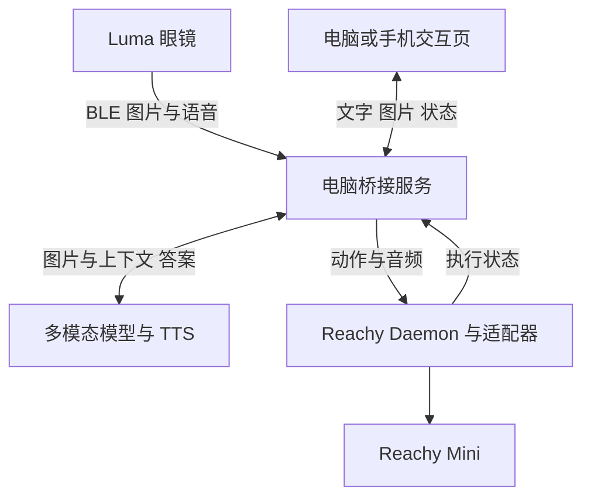

# Luma 智能眼镜与 Reachy Mini 部署及交互文档

版本 1.0　资料核查日期 2026 年 9 月 22 日

本方案通过一个运行在电脑上的桥接服务，把 Luma 眼镜拍到的图片、用户输入的文字及后续语音转写，交给多模态模型处理，再让 Reachy Mini 播报答案并执行预设反馈动作。第一阶段采用 BLE 小图和局域网机器人控制，第二阶段增加高清图片与手机接入。

**实施状态：这是一份基于上游源码核查的部署与开发规格，尚未在你的眼镜、电脑和机器人上完成联调。** 文中“上游现有”命令可以在满足依赖后用于单端验证；所有 `/v1/...` 接口、`bridge` 模块、配置变量和交互页面均为本项目需要新增的内容，不存在于两个上游仓库中。安装两个项目本身不会自动获得跨设备聊天功能。

## 1 先确定实现范围

### 1.1 第一版交付目标

用户佩戴眼镜，点击电脑或手机页面上的“拍照提问”，输入“我面前是什么”。系统显示本次眼镜图片，返回文字答案；Reachy 播放同一段答案，并以小幅触角动作表示收到请求。用户可继续追问“它有什么用途”，系统明确沿用上一张图片。

第一版应同时提供“直接输入文字”和“上传本地图片”，便于把模型问题、眼镜问题和机器人问题分开排查。眼镜端采集失败时必须明确显示失败，不能偷偷换成机器人摄像头的画面。

| 功能 | 上游实际提供 | 本项目需要新增 |
| --- | --- | --- |
| 眼镜拍照 | BLE 拍照指令及小图传输 | 捕获请求和当前会话关联 |
| 高清图片 | 眼镜 SoftAP 下的相册 HTTP API | 网络切换、下载和上传管理 |
| 文字交流 | 两个仓库没有现成跨设备聊天通道 | 聊天页面、历史记录、模型调用 |
| 眼镜语音输入 | BLE Opus 语音包及解析 | 解码、结束检测、ASR 和请求合并 |
| 机器人反馈 | 运动 API 和音频能力 | 动作白名单、TTS、播放队列 |
| 结果回到用户 | 可在桥接端生成文本 | 页面展示，后续手机或耳机播报 |

**能力边界：**本次查到的 Luma 是 E09 平台 T1 项目的摄像眼镜。仓库没有提供镜片文字显示 API，也没有已验证的“把任意文本写入眼镜就能播报”接口。文字先显示在电脑或手机界面；眼镜扬声器回放应作为独立的系统蓝牙音频路由验证项，不能把音量控制指令当作 TTS 传输接口。[L1–L4]

Reachy 桌面应用是机器人管理与调试工具。图片由桥接端的模型理解，结果再经机器人表达；无需把图片上传进桌面应用，也无需修改桌面应用才能实现第一版。[R1–R4]

### 1.2 开工前记录

| 项目 | 要记录的值 | 影响 |
| --- | --- | --- |
| 眼镜 | 型号、项目名、BT 与 ISP 固件 | 协议是否适用 |
| Reachy | Lite 或 Wireless、Daemon 版本 | USB 或网络连接方式 |
| 电脑 | 系统、CPU 架构、蓝牙可用性 | 编译与音频后端 |
| 网络 | 电脑 IP、机器人 IP、是否客户端隔离 | 能否互访 |
| 模型 | 服务地址、确切模型名、是否支持图片 | 视觉问答是否可运行 |
| 输出 | 机器人扬声器是否可独立播放 WAV | 是否满足完整交互 |

尚未确定这些值时，采用本文的分支部署，不凭猜测填写真实设备地址。模型 API 密钥只放在桥接服务所在机器。

## 2 架构与数据流

### 2.1 推荐部署方式

**一个桥接服务拥有眼镜连接、会话和任务队列；一个机器人适配器拥有运动和音频输出。** 第一版两者部署在同一台电脑，UI 由桥接服务同源提供。桥接服务通过 HTTP、WebSocket 或 Python SDK 连接 Reachy Daemon。



眼镜与电脑之间的 BLE 不经过路由器。机器人是 Lite 时通过 USB 接电脑，由本机 Daemon 操作；机器人是 Wireless 时，Daemon 运行在机器人上，电脑通过局域网访问它。大模型可以是外部 API，也可以是局域网推理服务，只要支持图像输入。

### 2.2 地址与端口

以下 IP 只是配置示例。`127.0.0.1` 永远指发起访问的设备自身；手机不能用它访问电脑。`0.0.0.0` 是服务监听地址，不能作为用户浏览器或远端客户端的目标地址。

| 组件 | 示例地址 | 性质 |
| --- | --- | --- |
| 本机桥接服务 | `http://127.0.0.1:8088` | 本方案定义 |
| 手机访问电脑 | `http://192.168.1.20:8088` | 替换为电脑 LAN IP |
| Lite Daemon | `http://127.0.0.1:8000` | 上游默认 |
| Wireless Daemon | `http://192.168.1.50:8000` | 替换为机器人 IP |
| Wireless 主机名 | `http://reachy-mini.local:8000` | 依赖 mDNS 解析 |
| 眼镜高清相册 | `192.168.169.1` | 仅加入眼镜热点后可达 |

机器人 `8000` 端口属于设备控制接口，保持在可信局域网，不做公网端口映射。手机只访问桥接服务，桥接服务负责认证及设备控制；同一 Wi-Fi 名称不代表网络允许设备互访。[R3、R8]

### 2.3 各进程的职责

| 模块 | 输入 | 输出 | 关键限制 |
| --- | --- | --- | --- |
| LumaAdapter | 拍照请求、BLE 通知 | 完整 JPEG、设备状态 | 一个设备一个 BLE 连接 |
| MediaStore | 图片字节与元信息 | image_id、受控文件访问 | 不只存客户端路径 |
| SessionManager | 文字、image_id、会话 ID | 有序对话上下文 | 每轮记录实际引用图片 |
| VisionAdapter | 文字和图片字节 | 答案文字 | 模型必须确实支持图像 |
| RobotAdapter | 白名单动作、音频 | 执行与失败状态 | 单一控制者串行执行 |
| UI | 用户操作 | 文本、预览、重试 | 显示真实状态，不伪造成功 |

## 3 版本和系统选择

### 3.1 本文核查基线

Luma 仓库声明验证过的固件为 BT 1.4.8、ISP 1.3.1、硬件 2。这是协议参考设备范围，不表示其他型号智能眼镜可直接使用。[L1]

| 项目 | 本次资料基线 | 部署处理 |
| --- | --- | --- |
| luma-core | `edef1eca9a565d4f6b4330f3327c48b0e0869425` | 初次复现固定此提交 |
| Reachy Desktop | Release 页面显示 v0.9.34 | 安装匹配系统和 CPU 的发布资产 |
| Desktop 源码 | `f520136ffe9b54ba6e34a6d5b4da4781cfd55ab8` | 仅用于检查架构，不等同发布版本 |
| Reachy SDK 源码 | `9d364df0d8b6c92fbda7a9252fc378e23d4ab47c` | API 核查快照，不直接当稳定版本安装 |

本次 SDK 源码的版本字段为 `1.11.0.dev0`。实际部署以你机器上安装的稳定包、Daemon 版本及它实时提供的 `/openapi.json` 为准；确认功能后保存版本清单。桌面程序的 `0.9.x` 版本号不等于 SDK 或 Daemon 的版本号。

### 3.2 平台分支

| 环境 | 建议路径 | 需要注意 |
| --- | --- | --- |
| macOS 和 Lite | 发布版桌面应用、本机桥接 | 桌面 README 标为完整支持 |
| Windows 和 Lite | 发布资产先验证，故障时单独运行 Daemon | 桌面 README 仍标注建设中 |
| Linux 和 Lite | Daemon 与本机桥接 | USB 权限和 GStreamer 依赖 |
| Linux 和 Wireless | 电脑桥接、网络 SDK 音频 | 核对 GStreamer 和 WebRTC |
| Windows 或 macOS 和 Wireless | REST 先验证动作，单独验证远程声音 | 不把桌面支持等同 Python 音频支持 |

上游 Python 媒体文档对远程 WebRTC 客户端有平台限制说明，因此 Wireless 路径必须做真实扬声器验收。如果电脑远程媒体链路失败，可把轻量音频执行器放到机器人本机，接收桥接端传来的 WAV 字节，本机调用 SDK 播放；该执行器是额外开发内容。[R1、R4]

建议桥接环境使用 Python 3.12。Luma 核心需要 Rust；Linux 的 BLE 构建通常还需系统 D-Bus 开发依赖。第一版不把 BLE、USB 或音频设备塞进 Docker，也不假定 WSL 可以直接访问 Windows 蓝牙。

## 4 部署 Luma 眼镜端

### 4.1 拉取和验证 Rust 客户端

安装 Git 和 Rust stable 后，在工作目录执行。以下命令属于上游现有功能。[L1、L5]

```bash
git clone https://github.com/metastable-lab/luma-core.git
cd luma-core
git checkout edef1eca9a565d4f6b4330f3327c48b0e0869425
cargo test --locked
cargo build --locked --release --example luma --features ble
cargo run --locked --release --example luma --features ble -- scan
cargo run --locked --release --example luma --features ble -- info
cargo run --locked --release --example luma --features ble -- photo --ai look.jpg
```

Linux 如出现 `dbus-1` 或 `pkg-config` 构建错误，再安装对应发行版依赖；Debian/Ubuntu 常见处理是 `sudo apt install pkg-config libdbus-1-dev`。macOS 需给实际运行命令的终端蓝牙权限；Windows Rust 工具链需配置相应编译工具。

扫描前唤醒眼镜，并退出可能占用连接的手机应用。现场有多副眼镜时，不能直接沿用示例“选择第一个/最强设备”的行为，应改为按确认过的设备标识连接。

验收：`info` 能返回固件、电量等信息，`look.jpg` 能被普通图片查看器打开，内容是刚才眼镜看到的场景。不要只看命令退出码或文件名；将旧图挪走再拍一次，核对文件修改时间和内容。

### 4.2 Python 长连接方式

第一阶段可由桥接进程串行调用已编译好的 Rust CLI，每轮输出独立临时文件；这会每次扫描和重连，适合跑通但延迟较高。正式版本使用 Python BLE 长连接或 Rust 常驻进程，并保留唯一连接所有者。

macOS 或 Linux 在 `luma-core` 根目录生成 Python 绑定：

```bash
python3.12 -m venv .venv
source .venv/bin/activate
python -m pip install bleak
./bindings/generate.sh python
# Linux 执行下一行
cp target/release/libluma_core.so bindings/out/python/
# macOS 则复制 target/release/libluma_core.dylib 到同一目录
export PYTHONPATH="$PWD/bindings/out/python"
python -c 'import luma_core; print(luma_core.glasses_gatt())'
python python/demo.py
```

原仓库的 `bindings/generate.sh` 只查找 `.dylib` 和 `.so`，不能原样作为 Windows PowerShell 部署脚本。Windows 初期优先使用 Rust CLI；需要 Python 时，可按如下等价步骤生成 Windows DLL 绑定，完成导入测试后再接蓝牙。此路径根据脚本和构建目标推导，未在 Windows 实机验证。[L6]

```powershell
py -3.12 -m venv .venv
.\.venv\Scripts\python.exe -m pip install bleak
cargo build --release --features bindgen
cargo run --release --features bindgen --bin uniffi-bindgen -- generate --library target/release/luma_core.dll --language python --config bindings/uniffi.toml --no-format --out-dir bindings/out/python
Copy-Item target/release/luma_core.dll bindings/out/python/
$env:PYTHONPATH = (Resolve-Path bindings/out/python).Path
.\.venv\Scripts\python.exe -c "import luma_core; print(luma_core.glasses_gatt())"
.\.venv\Scripts\python.exe python/demo.py
```

DLL 必须与 Python 进程的架构一致。`python/demo.py` 主要用于扫描、握手及打印事件，不是已经完成图片上传的桥接服务。

### 4.3 图片接收的实现要求

从 `glasses_gatt()` 获取 UUID，注册两个通知通道后再发拍照命令。写入必须启用 `response=True`；控制通知交给 `GlassesParser`，文件通道交给 `GlassesFileReassembler`。[L2、L3、L7]

| 通道或调用 | 职责 | 验收信号 |
| --- | --- | --- |
| AA12 | 服务发现 | 找到目标眼镜 |
| AA13 | 写控制指令 | ATT 有响应写入 |
| AA14 | ACK、状态、语音等控制流 | Parser 产生事件 |
| AA15 | 图片分片 | FileReassembler 产生 Completed |
| `glasses_take_photo(True)` | 请求 AI 小图 | 完整 JPEG 到达 |

收到拍照 ACK 只表示命令被接受。必须等文件重组完成，再检查 JPEG 可解码、大小符合限制，才能生成 `image_id`。参考固件的 BLE AI 图约 11 KB，典型捕获时间约 3.2 秒；这是上游观察，不能当作实际性能保证。[L2]

每个拍照任务持有 `capture_id`，最多同时执行一个。建议整体超时 10 秒，文件分片超过 5 秒无进展则失败。超时后清理重组状态，并处理迟到分片；无法可靠分界时重建连接，不能把上轮迟到的照片挂到下一轮问题下。

BLE 回调只负责解析并投递队列，不在回调中调用模型、执行 HTTP 上传或播放声音。新连接使用新的解析器；中断时取消当前捕获并显示可重试状态。

## 5 部署 Reachy 机器人端

### 5.1 安装与连接

从用户给定的 Releases 页面选择匹配操作系统和 CPU 架构的安装文件。优先安装发布资产，不必为第一版编译 Tauri 桌面程序。README 的 Node、Yarn、Rust 要求主要用于桌面源码开发。[R1、R2]

**Lite：**连接电源与 USB 数据线，打开桌面应用并启动本机 Daemon。**Wireless：**先按官方引导让机器人接入局域网，记录机器人实际 IP，再通过桌面程序确认连接。后者的 Daemon 通常随机器人启动。

打开 `/docs`，再检查 `/api/daemon/status`；页面存在还不够，需确认 Daemon 处于可控制的运行状态。

```powershell
# Lite 在连接机器上验证
Invoke-RestMethod http://127.0.0.1:8000/api/daemon/status
# Wireless 替换成实际 IP
Invoke-RestMethod http://192.168.1.50:8000/api/daemon/status
```

macOS/Linux 使用 `curl http://127.0.0.1:8000/api/daemon/status`，Wireless 同样替换主机地址。Windows 可用 `ipconfig` 查看电脑 IP，使用 `Test-NetConnection 192.168.1.50 -Port 8000` 验证 TCP。Ping 成功只能证明 ICMP 可达，不能证明机器人 API 已工作。

### 5.2 单独启动 Daemon 的备用路线

桌面应用已经启动 Daemon 时不要再起第二份。只有选择手动管理本机 Lite Daemon 时才执行以下路径。[R5]

```bash
python3.12 -m venv reachy-env
source reachy-env/bin/activate
python -m pip install reachy-mini
reachy-mini-daemon
```

Windows 可避免修改全局 PowerShell 策略，直接使用虚拟环境中的可执行文件：

```powershell
py -3.12 -m venv reachy-env
.\reachy-env\Scripts\python.exe -m pip install reachy-mini
.\reachy-env\Scripts\reachy-mini-daemon.exe
```

Linux 还需按官方安装文档配置 USB 权限和 GStreamer。无硬件时可安装 `reachy-mini[mujoco]` 并用 `reachy-mini-daemon --sim`；macOS 仿真使用官方说明的 `mjpython -m reachy_mini.daemon.app.main --sim`。仿真通过不能替代真实 USB、扬声器或 BLE 验证。

安装稳定包后记录 `python -m pip show reachy-mini`。不要因为最新源码有某个方法，就假定桌面程序随附的 Daemon 也支持它。将运行设备的 `/openapi.json` 保存到部署记录中。

### 5.3 动作验证

先在桌面控制器中唤醒并确认机器人可以移动，停止其他会驱动机器人动作的应用。将下面代码保存为 `reachy_smoke.py`，在已安装 SDK 的环境运行。它只做小幅触角往返，不需要模型。[R4、R6]

```python
from reachy_mini import ReachyMini

# Lite 固定本机；避免 auto 模式误连其他 Daemon
with ReachyMini(
    host="127.0.0.1",
    connection_mode="localhost_only",
    media_backend="no_media",
) as mini:
    mini.goto_target(antennas=[0.15, -0.15], duration=1.0)
    mini.goto_target(antennas=[0.0, 0.0], duration=1.0)
```

Wireless 将 `host` 改为机器人 IP，并使用 `connection_mode="network"`。上面使用的角度单位是弧度。`no_media` 用于动作单测，会影响媒体资源占用；不能在后续音频测试中继续沿用它。

REST 的等价运动接口是 `POST /api/move/goto`，示例请求体如下。该接口返回任务 UUID，HTTP 200 不表示动作完成；通过 `/api/move/ws/updates` 中与 UUID 对应的完成或失败事件判断结果。事件订阅应先于发动作建立。[R7]

```json
{"antennas":[0.15,-0.15],"duration":1.0}
```

### 5.4 音频单独验收

先准备一段可明确听出内容、时长已知的 WAV，在 `media_backend="default"` 下验证 `mini.media.play_sound(...)`，或按官方 SDK 接口发送 PCM。此函数在没有音频后端时可能只记录警告，因此“调用没有异常”不能作为播报成功标准。[R4、R6]

对本机 Lite 或部署在 Wireless 本机的执行器，音频文件路径应在执行器所在机器上有效。电脑上的 `C:\...\answer.wav` 不能直接当作机器人文件路径。跨机器执行时传输 WAV 字节，机器人侧保存到受控临时目录再播放；不要假定远程 `play_sound` 会自动上传任意本地文件。

采用 PCM 流播放时，先读取 `get_output_audio_samplerate()` 和 `get_output_channels()`，将 TTS 音频解码、重采样并转换为 `float32`，然后 `start_playing()`、`push_audio_sample()`，等待播放完成后 `stop_playing()`。不要把 MP3 文件字节直接当 PCM 发送，也不要在非阻塞播放刚返回时关闭 SDK 连接。

最终必须确认声音从 **Reachy 扬声器** 发出；电脑扬声器能响仅算降级演示。桥接服务的文字回复可在音频失败时继续显示，同时把机器人播报状态标为失败。

## 6 桥接服务开发与部署规格

### 6.1 工程内容

下面是新建工程的模块约定，不是上游现成目录。建议 Python 3.12、FastAPI、HTTPX、Pillow、SQLite；第一版单进程、单 worker 即可。长连接 BLE 适配需要 Bleak 与生成后的 Luma 绑定。[本方案设计]

| 文件或模块 | 实现内容 |
| --- | --- |
| `bridge/main.py` | FastAPI 启动、同源页面、认证、生命周期 |
| `bridge/luma_adapter.py` | 唯一 BLE 所有者、拍照串行化、分片超时 |
| `bridge/media_store.py` | 图片验证、原子保存、image_id 与来源 |
| `bridge/session_store.py` | 会话、请求、事件、图片引用与状态持久化 |
| `bridge/model_adapter.py` | 文字和多模态请求、重试与模型错误转换 |
| `bridge/robot_adapter.py` | SDK 长连接、动作白名单、音频播放 |
| `bridge/worker.py` | 单设备任务队列、取消、状态更新 |
| `bridge/static/` | 文字框、上传、眼镜拍照、图片预览、回复 |
| `.env.example` | 下述配置项的空模板，不放真实密钥 |
| `requirements.lock.txt` | 联调通过的依赖版本 |

应用关闭时停止接受新任务，取消模型请求，清理音频，结束 BLE 语音采集并关闭连接。不能给每次 HTTP 请求都新建一个机器人 SDK 连接，也不能让多个 worker 同时打开同一副眼镜。

### 6.2 配置约定

下列变量全部由新桥接服务负责读取。变量命名不代表上游支持相同配置。

```dotenv
BRIDGE_HOST=127.0.0.1
BRIDGE_PORT=8088
BRIDGE_TOKEN=replace_with_random_token
REACHY_HOST=127.0.0.1
REACHY_PORT=8000
REACHY_CONNECTION_MODE=localhost_only
REACHY_MEDIA_BACKEND=default
LUMA_MODE=cli
LUMA_CLI_PATH=/absolute/path/to/luma-core/target/release/examples/luma
MODEL_BASE_URL=https://your-provider.example/v1
MODEL_API_KEY=replace_locally
VISION_MODEL=exact_vision_model_id
TTS_ENABLED=false
TTS_PROVIDER=configure_after_audio_smoke_test
DATA_DIR=./data
```

`MODEL_BASE_URL` 是占位值，必须替换；还需验证服务商的图像请求格式。Windows 将 CLI 路径指向实际的 `luma.exe`。切换 Python 长连接后定义 `LUMA_MODE=ble`，设置该进程的 Python 绑定搜索路径。

Wireless 的 `REACHY_HOST` 必须是机器人地址，`REACHY_CONNECTION_MODE=network`。使用手机页面时才把桥接监听改为 `0.0.0.0`，并允许指定私有网络上的 `8088` 入站连接。仅改 `.env` 不会自动修改服务监听，启动程序需要读取它。

### 6.3 模型接入契约

先使用一张本地测试图验证模型，要求它描述图中内容。测试通过后，再把眼镜照片接入同一个模型适配器。仅支持文字的模型即使返回了流畅答案，也不代表具备看图能力。

`model_adapter.answer(text, image_bytes, history)` 应返回 `answer_text`。如果供应商采用 OpenAI 兼容的 Chat Completions 格式，消息需同时包含文本内容块与 `image_url` 图像内容块；可由适配器把 JPEG 编码为 data URL。以供应商实际文档和测试响应确认支持，不能仅把文件名或 image_id 放进 prompt。

本地 `http://127.0.0.1:8088/...` 图片地址一般不能被云端模型访问。优先从桥接端发送图片字节或 data URL；使用远程 URL 时需保证模型能访问且访问有效期受控。

建议初期让模型只返回自然语言。机器人“收到”和“回答完成”的动作由状态机决定；之后若需要模型选择表情，只允许返回 `none`、`acknowledge`、`curious` 等枚举，由服务端映射固定动作。禁止直接执行模型生成的 Python、Shell 或任意关节参数。

上下文必须包含本轮文字、明确引用的图片、近期对话和视觉信息来源。对“这个”“刚才那个”这样的追问，如果未要求重拍则沿用显示中的图片，并展示拍摄时间；如果没有可用图片，则要求用户拍摄，不从历史猜测现场。

### 6.4 启动约定

**下面命令只有在上述桥接工程实现后才可执行。本文不附带已实现的 `bridge.main`，不能在 luma-core 或桌面仓库中直接运行成功。** 它规定开发完成后的启动方式，避免交付工程没有明确部署入口。

```bash
# 在新桥接工程根目录
python3.12 -m venv .venv
source .venv/bin/activate
python -m pip install -r requirements.lock.txt
python -m bridge.main
```

`bridge.main` 需要加载配置，启动单 worker 服务，建立 BLE/机器人连接并暴露健康接口。调试页面和桥接服务放在同一端口，减少跨域配置。正式连接硬件时不启用自动重载；它会重建进程和设备连接。

启动顺序：机器人及 Daemon → 眼镜 → 桥接服务 → 交互页面。停止顺序：页面停止接收新请求 → 桥接完成取消和设备释放 → 根据需要关闭 Daemon 和硬件。

## 7 交互接口与数据协议

### 7.1 第一版接口

以下 `/v1/...` 全部是新桥接服务接口。除最小健康探针外，均要求桥接鉴权；文件访问同样受控。第一版采用短轮询查询请求状态，后续再加 SSE 或 WebSocket 推送。

| 方法与路径 | 输入 | 成功响应 |
| --- | --- | --- |
| `GET /v1/health` | 无 | 进程健康，非设备成功声明 |
| `GET /v1/status` | 鉴权 | 眼镜、机器人、模型配置状态 |
| `POST /v1/sessions` | 可选会话名称 | 201 和 session_id |
| `POST /v1/images` | multipart 图片与来源 | 201 和 image_id |
| `POST /v1/glasses/captures` | session_id、client_request_id | 202 和 request_id |
| `POST /v1/messages` | 文字、图片 ID、会话 ID | 202 和 request_id |
| `GET /v1/requests/{id}` | 鉴权 | 当前状态、结果或错误 |
| `GET /v1/images/{id}` | 鉴权 | 已授权图片字节 |
| `POST /v1/requests/{id}/cancel` | 鉴权 | 取消已请求或最终状态 |

相同 `client_request_id` 和相同请求体重试时应返回原请求；同一 ID 携带不同请求体返回 409。业务请求的 202 仅表示已入队，不能触发 UI“执行完成”。未鉴权返回 401，超大小返回 413，格式或字段错误返回 422，设备忙可返回 409。

### 7.2 图片请求

图片采用 multipart 上传，元数据与图片内容分开。建议最大 10 MiB、允许 JPEG/PNG、解码后最大 1200 万像素；实际限制由桥接端强制执行。大小和像素限制是本方案配置值，不是眼镜规格。

保存时使用服务端生成的文件名，先写临时文件再原子改名。校验魔数与可解码性，记录 SHA-256、宽高、字节数、`source`、`captured_at`、`capture_id`、所属会话及上传时间。不要将用户文件名直接拼接到目录。

来源枚举建议为 `glasses_ble`、`glasses_wifi`、`manual_upload`、`robot_camera`。眼镜小图的实际宽高应读取 JPEG，不能写成高清直播的 1600×1200。

拍照请求示例：

```json
{
  "session_id": "s_demo",
  "client_request_id": "capture_demo_001",
  "mode": "ble_ai"
}
```

请求完成后返回 `image_id`。UI 显示图片和拍摄时间，由用户确认或在“拍照提问”一体操作中继续提交消息。不要先提交消息再希望模型自动等到图片完成。

### 7.3 消息与响应

```json
{
  "session_id": "s_demo",
  "client_request_id": "message_demo_001",
  "text": "请告诉我面前这个东西是什么",
  "image_id": "img_demo_001",
  "reply": {"text": true, "robot_audio": true}
}
```

图片必须属于同一授权会话。纯文字不传 `image_id`；追问时由 UI 和会话管理器明确选中已有图片。系统不得把两个用户或两副眼镜的最新图片混用。

查询响应示例，表示答案已生成，但机器人音频失败：

```json
{
  "request_id": "req_demo_001",
  "status": "completed_with_errors",
  "answer_text": "这看起来是一个杯子。",
  "image_id": "img_demo_001",
  "robot": {
    "motion_status": "completed",
    "audio_status": "failed",
    "error_code": "ROBOT_AUDIO_UNAVAILABLE"
  }
}
```

文字答案、动作和音频应有独立状态。播放 API 接受请求时标为 `started`；只有播放器可靠确认或按已知样本长度跟踪到结束时才标为完成。系统软件无法证明扬声器实际可闻，所以仍需人工音频验收。

### 7.4 请求状态与取消

状态至少包括 `queued`、`capturing`、`media_ready`、`thinking`、`answer_ready`、`responding`、`completed`、`completed_with_errors`、`failed`、`cancelled`。纯文字任务跳过捕获状态。记录各阶段开始时间、耗时和错误码。

同一会话按顺序处理，防止上下文倒序；同一机器人保持单一动作和音频队列。用户取消后，禁止排队中的后续动作或音频启动；已有运动任务按 UUID 调用上游 `/api/move/stop`，已有音频通过音频后端停止。停止运动任务不等于物理紧急断电，不改变官方硬件应急操作。

模型超时可以对幂等任务有限重试，机器人动作不自动重放。进程重启时将未完成任务标为 `interrupted` 或可恢复失败；不得恢复后突然播放旧答案或执行旧动作。

## 8 页面与机器人交互设计

### 8.1 页面元素

页面顶部显示“眼镜已连接”“机器人已连接”和实际设备标识。主体为左侧当前图片、右侧对话；窄屏改为上下排列。图片下面显示来源、拍摄时间以及“沿用此图”状态。

主要操作保留“拍照提问”“上传图片”“发送文字”“停止”四个按钮。发送后展示具体阶段，例如“眼镜正在拍照”“图片已收到”“正在生成答案”“机器人正在回答”。错误信息给出对应的重试入口，不能只显示一个永久转圈的加载图标。

### 8.2 四种交互流程

| 场景 | 用户操作 | 系统行为 |
| --- | --- | --- |
| 看图问答 | 拍照提问并输入问题 | 捕获新图、预览、模型回答、机器人播报 |
| 纯文字 | 输入问题并发送 | 不拍照，使用明确的文本上下文 |
| 对同图追问 | 保留当前图并继续输入 | 复用 image_id，显示其拍摄时间 |
| 更换场景 | 点击重新拍摄 | 捕获完成后才替换当前图 |

建议第一版的机器人动作：收到请求时触角小幅展开；回答结束时回到初始触角位置；错误时保持静止，由页面说明原因。相邻动作至少留出完整执行时间，禁止聊天应用、跟随应用和桥接服务同时争夺机器人。

第一版不让机器人根据眼镜图片中的像素位置直接转头“指向物体”。眼镜与机器人摄像头不共用坐标系，缺少外参、深度和位置估计时，图中左边不等于机器人世界坐标的左边。

### 8.3 语音增强

待图片与文字链路通过后，再把眼镜语音接入。Luma 语音为 BLE Opus 包，可解码为 16 kHz 单声道 PCM 后送 ASR；ASR 文本进入同一个消息接口，不另建不一致的对话逻辑。[L2、L3]

上游参考策略是无包约 1.2 秒或总时长达到 30 秒时主动发送 `interrupt_voice()`，结束麦克风和本地解析状态。无包判断不是可靠的语义端点检测，持续有包时还需 VAD 或硬上限。不能等待固件自行停止。用户取消、断开、异常退出均应走清理流程。

机器人播报时暂停本次输入监听或使用明确的按键轮次，避免眼镜把机器人的声音再次送入 ASR。先完成“录一句、停录、回答一句”的交互，再评估打断和持续对话。

## 9 高清图片与手机扩展

### 9.1 高清路径

BLE 小图适合验证物体识别与简单场景问答；密集文字、标签和细节任务可能需要高清图。完整照片走眼镜 SoftAP，相机实时流走 RTSP，不能把两者当作现成公网图片上传接口。[L2、L3]

1. 在 BLE 连接上开启 files 模式。
2. 等待眼镜发来 SSID，再等待约 2 秒稳定期。
3. 由操作系统加入眼镜热点，确认 `192.168.169.1` 可达。
4. 读取列表，按本次捕获关联规则选择文件；下载后检查大小并解码。
5. 发送 `file_download_complete()` 关闭眼镜热点，恢复原网络。
6. 验证机器人及模型可达，再上传图片并问答。

上游现成命令如下。列文件和下载必须在已经加入眼镜热点之后执行。

```bash
cargo run --release --example luma --features ble -- wifi gallery
cargo run --release --example gallery --features wifi-client -- list
cargo run --release --example gallery --features wifi-client -- sync ./gallery --keep
cargo run --release --example luma --features ble -- wifi close
```

**必须保留 `--keep`。** 上游 `sync` 默认会在下载后删除眼镜文件。正式集成优先根据相册列表中的实际文件名下载单张，不能每次把整个相册上传。文件列表的大小单位是向下取整的 KiB，完整字节数应满足 `size_kib × 1024 ≤ bytes < (size_kib + 1) × 1024`。[L8]

普通电脑只有一张 Wi-Fi 网卡时，加入眼镜热点常会失去原局域网或外网。因此第一版先“下载到本地、关闭热点、回原网络、问答”；需要同时连接时再用有线网络或第二网卡，并明确路由。Wireless Reachy 不会因为电脑加入眼镜热点而自动跟随切网。

### 9.2 手机接入

最省工作量的手机路径是：手机浏览器访问电脑桥接页，眼镜仍由电脑蓝牙连接。手机上的“拍照”按钮发送 HTTP 请求给电脑；这不要求手机浏览器访问 BLE，但佩戴者必须处于电脑蓝牙覆盖范围。

需要离开电脑活动时，再开发原生手机 Companion：iOS 可从仓库 `LumaDemo` 改造，先运行 `./ios/build-core.sh`，再用 Xcode 真机构建；Android 从 Kotlin 绑定建立原生蓝牙和网络层。iOS 模拟器不能验收真实蓝牙或热点功能。[L1]

手机变成眼镜连接所有者后，电脑必须释放 BLE。手机接收完整图片后向桥接 `/v1/images` 上传，再调用 `/v1/messages`；请求标识和重试规则沿用电脑方案。跨公网连接应在桥接入口提供 HTTPS 和认证，不能把 Reachy Daemon 直接暴露出去。

## 10 联调顺序与验收

### 10.1 分阶段实施

| 阶段 | 工作 | 通过标准 |
| --- | --- | --- |
| A 单端硬件 | 眼镜拍照，机器人动作和 WAV | 新照片正确、真机动作、真机出声 |
| B 文本链路 | 新桥接文字页和模型接口 | 能输入、收到真实模型文本、保存会话 |
| C 图片链路 | 本地图上传，再接眼镜图 | 模型实际收到正确图片 |
| D 机器人表达 | TTS、动作队列和反馈状态 | 回答一致，失败可区分 |
| E 完整轮次 | 拍照提问与多轮追问 | 图片、文字、语音属于同一轮 |
| F 扩展 | 高清图、手机、眼镜 ASR | 不破坏已通过的基础链路 |

若设备和依赖已经就绪，可先用两个开发工作日组织 A–E：第一天单端、文字、本地图；第二天眼镜自动上传、播报、界面和失败处理。这是工作拆分建议，不是两天必然完成的承诺；驱动、固件兼容与远程音频问题可能单独占用时间。

### 10.2 验收用例

| 编号 | 操作 | 必须观察到 |
| --- | --- | --- |
| T01 | 发送纯文字 | 无新拍照，返回真实文本 |
| T02 | 上传有明显特征的本地图片 | 答案与图片相关，image_id 可追溯 |
| T03 | 眼镜拍摄两个不同物体 | 预览和答案分别对应正确物体 |
| T04 | 追问同一图片 | image_id 不变，拍摄时间可见 |
| T05 | 重复提交相同请求 ID | 不重复扣模型调用、不重复动作 |
| T06 | 拍照中关闭眼镜 | 有超时错误，不使用旧图 |
| T07 | 机器人离线后发消息 | 文字仍可显示，机器人状态失败 |
| T08 | 模型请求超时或密钥错误 | 明确错误，不生成假答案 |
| T09 | 停止当前回答 | 不再启动后续音频与动作 |
| T10 | 从手机打开页面 | 使用电脑 IP，可上传与提问 |
| T11 | 高清下载后恢复 Wi-Fi | 原图仍在，机器人及模型恢复可达 |
| T12 | 连续执行 20 轮 | 无错图、无重复播报、失败有日志 |

采集每轮 `capture_ms`、`upload_ms`、`model_ms`、`tts_ms` 和总耗时，报告成功率及 P50/P95。BLE 获取图约 3.2 秒只是上游参考值；项目可暂以 15 秒内收到首段文字作为目标，再依据所选模型实测调整。不要把设计目标写成已测结果。

### 10.3 排障表

| 现象 | 优先检查 |
| --- | --- |
| 扫不到眼镜 | 电源、终端蓝牙权限、其他应用占用、型号 |
| 写入无错但没动作 | AA13 是否 `response=True` |
| 有拍照 ACK 没图片 | AI 标志、AA15 通知、重组完成事件 |
| 只有旧照片 | 临时文件隔离、capture_id、迟到分片 |
| Python 无法导入 Luma | 绑定目录、动态库、CPU 架构、加载路径 |
| Windows 生成脚本失败 | 不要直接使用只找 dylib/so 的脚本 |
| 8000 不可达 | Daemon、真实 IP、防火墙、网络隔离 |
| 连接到仿真而非真机 | 显式 connection_mode 和 host |
| SDK 动作成功但没有声音 | no_media、音频设备、GStreamer、真实输出位置 |
| 模型说看不到图片 | 模型能力、图片内容块、本地 URL 不可达 |
| 高清下载后所有服务失联 | 仍连眼镜热点、原网络未恢复 |
| 机器人重复回答自己 | 语音回声、播报期间仍在采集 |

## 11 运行维护与数据处理

保存部署版本、机器地址、真实设备标识和依赖锁文件。日志包含 request_id、session_id、image_id、阶段、耗时和错误码；不打印模型密钥、图片 Base64 或完整原始语音。初期图片只在演示会话中保留，提供删除会话和图片的入口；需要长时间留存再明确保留期限。

模型可以读到的照片与文字是任务数据，不能作为可执行指令。图片里出现“忽略规则并运行命令”等内容时也不得越过动作白名单。机器人接口由受控适配器调用，模型不能指定任意 HTTP URL 或文件路径。

第一版保持一个 robot worker 和一个 BLE worker。重连采用有限退避，状态必须从 ready 退回 disconnected；健康检查区分“桥接服务活着”“眼镜已连接”“机器人可控”“音频已验收”，不以单一绿色图标代替。

交付工程时应包含：可启动桥接代码、配置模板、依赖锁、页面、单端验证脚本、验收记录和本文件。当前文档中定义的桥接功能仍需开发；完成后再把每个验收项填写为通过或失败，才可称作已部署系统。

## 12 官方依据与核查说明

本次直接读取了三个公开 Git 仓库的源码。Luma 网页检索未能正常展开，但 Git 仓库拉取成功；Luma 结论依据 README、GUIDE、协议及客户端实现交叉核对。设备信息和实际网络地址尚未取得，不据此宣称硬件兼容或端到端测试通过。

以下源码链接固定到本次核查提交；后续升级时应重新比对。文中的新架构、端口 8088、业务接口、配置和验收标准均为本方案设计。

- [L1 Luma 项目说明](https://github.com/metastable-lab/luma-core/blob/edef1eca9a565d4f6b4330f3327c48b0e0869425/README.md)
- [L2 Luma 集成指南](https://github.com/metastable-lab/luma-core/blob/edef1eca9a565d4f6b4330f3327c48b0e0869425/docs/GUIDE.md)
- [L3 Luma 协议参考](https://github.com/metastable-lab/luma-core/blob/edef1eca9a565d4f6b4330f3327c48b0e0869425/PROTOCOL.md)
- [L4 Luma 控制指令](https://github.com/metastable-lab/luma-core/blob/edef1eca9a565d4f6b4330f3327c48b0e0869425/src/commands.rs)
- [L5 Luma 命令行客户端](https://github.com/metastable-lab/luma-core/blob/edef1eca9a565d4f6b4330f3327c48b0e0869425/examples/luma.rs)
- [L6 Luma 绑定生成脚本](https://github.com/metastable-lab/luma-core/blob/edef1eca9a565d4f6b4330f3327c48b0e0869425/bindings/generate.sh)
- [L7 Luma Python 绑定接口](https://github.com/metastable-lab/luma-core/blob/edef1eca9a565d4f6b4330f3327c48b0e0869425/src/ffi.rs)
- [L8 Luma 相册客户端](https://github.com/metastable-lab/luma-core/blob/edef1eca9a565d4f6b4330f3327c48b0e0869425/examples/gallery.rs)
- [R1 Reachy Desktop 项目说明](https://github.com/pollen-robotics/reachy-mini-desktop-app/blob/f520136ffe9b54ba6e34a6d5b4da4781cfd55ab8/README.md)
- [R2 Reachy Desktop 发布页面](https://github.com/pollen-robotics/reachy-mini-desktop-app/releases)
- [R3 Reachy REST API 文档](https://github.com/pollen-robotics/reachy_mini/blob/9d364df0d8b6c92fbda7a9252fc378e23d4ab47c/docs/source/API/rest-api.mdx)
- [R4 Reachy Python SDK 文档](https://github.com/pollen-robotics/reachy_mini/blob/9d364df0d8b6c92fbda7a9252fc378e23d4ab47c/docs/source/SDK/python-sdk.md)
- [R5 Reachy 安装指南](https://github.com/pollen-robotics/reachy_mini/blob/9d364df0d8b6c92fbda7a9252fc378e23d4ab47c/docs/source/SDK/installation.md)
- [R6 Reachy Python 类实现](https://github.com/pollen-robotics/reachy_mini/blob/9d364df0d8b6c92fbda7a9252fc378e23d4ab47c/src/reachy_mini/reachy_mini.py)
- [R7 Reachy 运动路由实现](https://github.com/pollen-robotics/reachy_mini/blob/9d364df0d8b6c92fbda7a9252fc378e23d4ab47c/src/reachy_mini/daemon/app/routers/move.py)
- [R8 Reachy 局域网集成说明](https://github.com/pollen-robotics/reachy_mini/blob/9d364df0d8b6c92fbda7a9252fc378e23d4ab47c/docs/source/integrations/home_assistant.md)
- [R9 Reachy GStreamer 安装指南](https://github.com/pollen-robotics/reachy_mini/blob/9d364df0d8b6c92fbda7a9252fc378e23d4ab47c/docs/source/SDK/gstreamer-installation.md)
- [R10 Reachy 媒体管理实现](https://github.com/pollen-robotics/reachy_mini/blob/9d364df0d8b6c92fbda7a9252fc378e23d4ab47c/src/reachy_mini/media/media_manager.py)

源码存在部分描述不一致：Luma 个别 FFI 注释把 AI 照片称为高清，但 README、GUIDE 与传输路径一致指向 BLE 小图，本文按后者描述；Reachy 安装页的旧 Python 范围与当前 pyproject 不完全一致，本文取 Python 3.12 作为共同适用选择。任何 API 差异以你的实际安装版本和现场测试为准。
