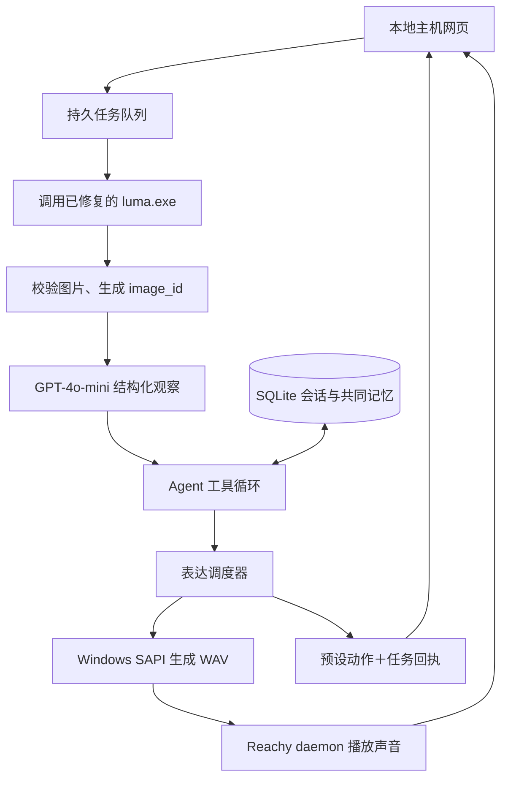

# Luma × Reachy 本地 Agent：完整构建、部署与验收指南

版本：2.0 · 2026-09-23
配套工程：`luma_reachy_agent.zip`。解压后本文件位于工程根目录。
本版交付可启动的参考工程，覆盖单图理解、自动串联、Agent 决策、Reachy 表达、共同记忆。安装后按本指南配置并验收，不需要先补写上一版中的伪代码函数。

## 1. 交付结果与事实边界

你要得到的体验是：点击“拍照分享”，眼镜拍摄并回传 JPEG；电脑自动理解图片，Agent 根据你的说明选择回应、重看原图或检索记忆；Reachy 以动作与语音回应。你能继续问同一张图的细节，也能让它记住某件事，在新会话中再提起。

| 功能 | 本版对应实现 |
|---|---|
| 单图理解 | `models.py` 调用 GPT-4o-mini，按 Pydantic Observation 输出结构化结果 |
| 自动串联 | `service.py` 持久任务＋单 worker，从拍照到回应自动执行 |
| Agent 决策 | 真实 Function Calling 循环，5 个工具、最大步数和参数校验 |
| Reachy 表达 | `robot.py` 使用 daemon HTTP 和动作 WebSocket；本地 SAPI 生成 WAV |
| 共同记忆 | SQLite 保存观察与用户陈述，关键词/中文二元词检索、跨会话使用、更正与删除 |
| 操作界面 | 浏览器页面：分享、图片追问、记忆、安静模式、停止和状态 |
| 自检 | `doctor.py` 检查采集、模型、TTS、机器人，以及一次真实表达 |

**本地运行 Agent、数据库、TTS 和设备适配器；GPT-4o-mini 由主机调用云端 API。** 这不是在本机下载 GPT-4o-mini 权重。图片会发给你配置的模型服务。

你此前贴出的日志已经报告过 `luma.exe photo --ai` 接收到真实 JPEG。本工程复用该二进制，把单次拍照接入自动流程。按眼镜实体按键自动上传并不等于主机命令拍照；当前入口固定为用户点击主机界面的“拍照分享”。

软件测试报告见 `TEST_REPORT.md`。本交付环境没有你的 Windows 蓝牙、中文 SAPI 声音与 Reachy 实物，不能替代第 12 节真机验收。软件中没有静默 mock：真实模式设备失败会显示失败。

## 2. 架构与运行位置



电脑运行一个 Python 服务；Reachy 桌面应用继续管理自己的 daemon。新 Agent 通过 API 连接现有 daemon，不打开机器人 COM 口，不再启动第二个 Reachy daemon。

两类连接独立：

- 眼镜：BLE → 你已有的 `luma.exe` → 本工程。
- Reachy：本工程 → daemon HTTP/WebSocket → 电机和扬声器。

本地 TTS 只负责“文字变 WAV”。扬声器负责发声，两者不需要新增硬件。

## 3. 文件清单与放置方式

建议将压缩包解压到现有项目旁的新目录，例如 `E:\EVO_Hack\local_agent`。不要覆盖已修复的 `upstream/luma-core` 或 `run_bridge.ps1`。本工程通过绝对路径调用已有 luma.exe。

| 文件 | 职责 |
|---|---|
| `install.ps1` | 创建隔离环境、安装依赖、首次生成 `.env` 和访问口令 |
| `start.ps1` | 从工程目录启动单实例服务 |
| `test.ps1` | 运行无真实硬件的自动化测试 |
| `.env.example` | 所有实际支持的配置字段 |
| `requirements.txt` | 依赖范围，Windows 自动安装 pyttsx3 |
| `constraints-tested.txt` | 本次软件测试中使用的依赖版本约束 |
| `agent_app/main.py` | 已实现的 API、鉴权、生命周期 |
| `agent_app/service.py` | 采集—理解—决策—表达串联 |
| `agent_app/models.py` | GPT-4o-mini 图片分析及工具决策 |
| `agent_app/contracts.py` | Observation、工具参数、请求模型 |
| `agent_app/media.py` | 图片导入、CLI 调用、TTS 子进程管理 |
| `agent_app/tts_worker.py` | 独立进程调用 Windows SAPI5 |
| `agent_app/robot.py` | Reachy 状态、动作任务、音频上传播放和停止 |
| `agent_app/storage.py` | SQLite、会话、记忆、幂等执行账本 |
| `agent_app/doctor.py` | 真实链路分段自检 |
| `agent_app/static/index.html` | 完整本地控制界面 |
| `tests/` | 闭环、异常路径、请求格式与适配器测试 |

启动后自动创建 `data/agent.db`、`data/images`、`data/audio`、`data/tmp`。每次采集使用唯一临时文件，校验后生成唯一 image_id，不复用上次照片充当新照片。

## 4. 安装：按顺序执行

### 4.1 确认 Python

在 Windows PowerShell 执行：

```powershell
py -0p
```

安装脚本优先使用 Python 3.11；未安装 3.11 时会自动回退到 3.12。也可以先手动建立 3.12 环境，安装脚本会复用它：

```powershell
Set-Location E:\EVO_Hack\local_agent
py -3.12 -m venv .venv
```

本次软件自动化测试运行于 Linux/Python 3.12；Windows/SAPI 留给真实主机验收。

### 4.2 安装工程依赖

```powershell
Set-Location E:\EVO_Hack\local_agent
.\install.ps1
```

若系统仅因为脚本执行策略阻止 `.ps1`，可以在当前终端使用进程级设置后再执行：

```powershell
Set-ExecutionPolicy -Scope Process Bypass
.\install.ps1
```

该操作不修改全局执行策略。脚本不会覆盖已有 `.env`，不会改现有 Luma 仓库。

默认安装已采用随包的已测依赖约束。Windows 专有 `pyttsx3` 和 COM 依赖仍需本机安装与核验。若需要手动安装，等价命令为：

```powershell
.\.venv\Scripts\python.exe -m pip install -r requirements.txt -c constraints-tested.txt
```

### 4.3 填写 `.env`

```powershell
notepad .env
```

至少填写以下字段，保留安装脚本生成的 BRIDGE_TOKEN：

```dotenv
OPENAI_API_KEY=填写你实际使用服务的密钥
OPENAI_BASE_URL=https://api.openai.com/v1
VISION_MODEL=gpt-4o-mini
AGENT_MODEL=gpt-4o-mini

LUMA_EXE=E:/EVO_Hack/upstream/luma-core/target/release/examples/luma.exe
LUMA_DEVICE=D8:53:65:00:00:55

REACHY_API_URL=http://127.0.0.1:8000
REACHY_MODE=real

TTS_VOICE_ID=
TTS_RATE=170
PORT=8765
BRIDGE_TOKEN=保留安装脚本生成的值
DATA_DIR=data
AUTO_MEMORY=true
MODEL_TIMEOUT=35
CAPTURE_TIMEOUT=45
TURN_TIMEOUT=150
MAX_STEPS=6
MAX_PENDING=3
```

这段展示字段用途，不能直接覆盖已经生成的真实口令。注意：

- LUMA_EXE 必须指向包含你“全量扫描＋目标设备过滤”修复的版本。
- 若使用中转服务，把 BASE_URL 和 KEY 替换成对应服务；模型名使用该服务实际支持的名称。必须通过后面的图片、结构化输出和工具调用探测。
- BRIDGE_TOKEN 是你这台本地应用自己的访问口令，不是模型密钥，也不是 Reachy 密钥。浏览器第一次连接时填写它。
- `REACHY_API_URL` 是实际 daemon 地址。8443 通常是信令端口，不应当直接代替控制 API。
- 当前已记录的远端 Reachy 地址为 `http://192.168.8.188:8000`，实际运行配置在
  `local_agent/.env` 中已指向该地址。该地址属于会场 LAN，换网络后必须重新执行
  `GET /api/daemon/status` 和 `GET /openapi.json` 验证，不能把任意 8000 端口当成机器人。
- 远端 daemon 可能处于 `state=running` 但 `backend_status.ready=false`。此时 Agent 保留文字
  结果并拒绝运动/语音写请求，待远端控制循环 ready 后再执行完整表达。
- `REACHY_MODE=real` 为完整闭环。`text_only` 仅供开发模型链路，不计入真机通过。
- 环境变量优先于 `.env`。若终端残留同名变量，先确认后用 `Remove-Item Env:变量名` 清除冲突，再启动。
- 本地 TTS 无需 TTS_API_KEY、TTS_MODEL 或额外云端语音付费服务。

## 5. 第一道验收：眼镜新照片到主机

先关闭占用同一副眼镜的其他桥接进程，再从本工程运行：

```powershell
.\.venv\Scripts\python.exe -m agent_app.doctor --capture
```

程序会自动：

1. 给子进程设置 LUMA_DEVICE。
2. 执行 `luma.exe photo --ai <唯一临时路径>`。
3. 等待成功退出，校验文件大小、JPEG/PNG/WebP 解码、像素数量。
4. 规范化方向，转成送模型的 JPEG，计算散列并写入数据库。
5. 输出 image_id、实际路径、宽高和时间。

把打印的 path 用以下方式打开：

```powershell
Start-Process '这里替换为doctor打印的完整图片路径'
```

让眼镜分别朝向两个明显不同的物体，执行两次，确认图片随现场变化。这一步成功才算“照片输入链路成立”。设备电量、版本信息只能证明握手，不能代替此项。

每次拍照结束会释放 BLE。用户按眼镜实体按键自动同步属于另一种采集模式，当前交付不冒充已实现该模式。

## 6. 第二道验收：本地中文 TTS

### 6.1 列出本机 SAPI 声音

```powershell
.\.venv\Scripts\python.exe -m agent_app.tts_worker --list
```

输出每个声音的 name、id 和语言。若能找到中文声音，将其完整 ID 原样填入 `TTS_VOICE_ID`。留空会尝试匹配常见中文名称；找不到则明确报错，不会偷偷使用英语声音。

Windows 的语音设置中下载中文声音后，仍需重新执行此命令确认 SAPI5 能看到它；并非所有 Windows 新式语音都暴露给 SAPI5。

### 6.2 生成 WAV 并试听

```powershell
.\.venv\Scripts\python.exe -m agent_app.doctor --tts
```

按输出的 wav 路径执行 `Start-Process '完整路径'`。听到清晰中文说明电脑 TTS 成功。

工程每次使用独立 Python 子进程初始化 pyttsx3/SAPI，避免 FastAPI 并发调用同一个 COM 对象。生成的 WAV 会校验帧数和时长；失败不会被报成成功。取消任务会终止对应生成进程。

这一步只验证电脑生成音频，不代表机器人已播放。

## 7. 第三道验收：模型三项能力

使用第 5 节拍到的实际图片：

```powershell
.\.venv\Scripts\python.exe -m agent_app.doctor --models --image 'E:\EVO_Hack\local_agent\data\images\替换为实际文件名.jpg'
```

自检会执行两类请求：

- 图片＋文本 → GPT-4o-mini → 严格 Observation 解析。
- 无副作用 echo 工具 → 模型 tool call → 应用 tool result → 模型最终回复。

通过时输出：`PASS: image input + structured output + tool call/result round trip`。

Observation 已在代码实现：

```json
{
  "summary": "桌上有一盆植物。",
  "visible_objects": ["植物", "花盆"],
  "readable_text": [],
  "uncertainties": ["无法确认植物品种"],
  "image_quality": "usable",
  "answer": "我看到了你分享的这盆植物。",
  "needs_better_image": false
}
```

程序会保存观察、模型标识、usage 与耗时。格式合法不代表视觉判断必然正确，因此不确定字段、原图追问和人工验收仍是必需环节。

API 超时、拒答、截断、无效 JSON、错误模型名都会返回错误。本版没有模型自动重试，避免中转层与应用层重复计费；用户可以重新提交一个明确的新任务。SDK `max_retries=0` 已显式设置。

## 8. 第四道验收：Reachy 表达

### 8.1 先启动已有 Reachy daemon

使用你现有的 Reachy 桌面应用启动机器人。关闭其他主动控制机器人动作的远程会话。本工程不会代替 daemon 管理串口，也不会自动重启或升级它。

```powershell
.\.venv\Scripts\python.exe -m agent_app.doctor --robot
```

该命令读取 daemon 状态与 OpenAPI，报告 ready、版本和缺失路由。`backend_status.ready` 必须为 true；仅看到端口监听或 state=running 不够。

本版参考适配器使用以下真实源码接口：

| 方法／路径 | 用途 |
|---|---|
| `GET /api/daemon/status` | backend 状态与版本 |
| `POST /api/move/goto` | 提交预设姿态轨迹，返回 uuid |
| `WS /api/move/ws/updates` | move_completed / move_failed / move_cancelled |
| `POST /api/move/stop` | 停止本应用已知的动作 uuid |
| `POST /api/media/sounds/upload` | 上传 WAV，返回机器人可见 path |
| `POST /api/media/play_sound` | 让机器人播放该音频 |
| `POST /api/media/stop_sound` | 停止文件播放 |

这些接口依据研究的 Reachy 源码快照实现。`--robot` 检查 HTTP 路由；WebSocket 通路在 `--express` 真实动作测试时检查。

如果本机版本缺少接口：先保存 `/openapi.json`，核对已安装 daemon 的接口。该情况是版本适配问题，应修改 `robot.py` 对应方法以匹配本机公开接口，或在保留现有可用安装后使用包含这些接口的兼容版本；**不能仅把 health 判断改成 true**。本包不包含 Reachy 固件与桌面应用，也不自动更换设备版本。

读取接口列表的 PowerShell 命令：

```powershell
$robotBase = 'http://127.0.0.1:8000'
$robotSpec = Invoke-RestMethod "$robotBase/openapi.json"
$robotSpec.paths.PSObject.Properties.Name
Invoke-RestMethod "$robotBase/api/daemon/status" | ConvertTo-Json -Depth 12
```

### 8.2 一次真实点头＋中文语音

```powershell
.\.venv\Scripts\python.exe -m agent_app.doctor --express
```

程序会合成短中文 WAV、执行预设点头，再上传并播放声音。请现场确认动作与声音都来自 Reachy。

实现细节：

- 动作采用约 5° 点头或 6° 侧倾，使用弧度发送，单段 0.8 秒，结束回中立；模型无权修改原始角度。
- 先连接动作 WebSocket，再提交 goto，避免动作很快完成导致漏掉事件。
- 收到对应 uuid 的 move_completed 才记录“daemon 确认动作完成”。这仍不是外部相机测得的运动精度。
- 音频上传成功后再发播放请求；播放 HTTP 成功记录 accepted。按 WAV 时长等待仅用来避免下一句话重叠，不伪造声音已完成的传感反馈。
- 停止回应会取消后续轨迹并请求停止本应用已知动作和音频；软件停止不等于机器人硬件急停。

声音由 Reachy 扬声器播放。本版不同时把任意音频推送到眼镜；眼镜媒体控制与“注入 TTS 音频”是不同能力。

## 9. 启动完整应用

完成四道验收后，先结束 doctor 命令，再执行：

```powershell
.\start.ps1
```

浏览器打开 `http://127.0.0.1:8765`，输入 `.env` 中的 BRIDGE_TOKEN，点击连接。

应用有单实例文件锁。另一个 start 或 doctor 使用同一 data 目录会拒绝启动，避免同时争用眼镜、数据库执行者和机器人。不要加 `--workers 2`，也不要用热重载跑真机演示。

### 9.1 一次完整分享

1. 在输入框写“看看这个”或具体问题。
2. 点击“拍照分享”。
3. 界面依次显示 queued、capturing、analyzing、deciding、expressing。
4. 新照片显示在页面，观察与执行状态可在折叠面板查看。
5. Reachy 回应一句话并做模型选定的预设动作。
6. 任务完成，记忆区显示这次分享的可追溯记录。

“分享所选照片”是第二个入口，用于调试或选择已有照片；它也会自动执行完整链路，来源保留为 image job，不会伪称新拍摄。

### 9.2 单图追问

看到照片后输入“它是什么颜色？”并点击“发送／针对这张图追问”。页面把当前 image_id 带入请求；服务会重新查看原图。图片不会因为新的文字追问而重新拍摄。

如果新建会话，图片关联清空。后端拒绝把其他会话的 image_id 当成本会话图片，防止串图。共同记忆则是当前本地用户共享的跨会话空间。

### 9.3 记住、回忆、更正

- `AUTO_MEMORY=true` 时，主动分享图片会自动生成“用户分享的画面：……”记忆，来源为视觉观察。
- 输入“记住，这是我今天买的植物”，Agent 调用 remember_event，以当前用户消息为证据保存用户陈述。
- 新建会话，问“今天我给你看过什么？”或“你记得那盆植物吗？”Agent 可查询持久记忆。
- 记忆卡片提供更正和删除。更正生成新的用户证据并标记旧记忆 superseded；删除从 active 记忆索引移除。
- 活动轮次中不允许编辑记忆，以免正在使用旧上下文的模型立即把被删除内容写回；先停止或等待该轮结束。

“删除记忆”仅作用于记忆索引，原分享图和会话仍保留。界面与 API 都说明了该范围。完整清空个人本地数据的方法见第 15 节。

### 9.4 安静与停止

开启安静模式，后续回复只显示文字，不进行 TTS 或动作。若当前任务正在运行，开启安静会取消该轮并尝试停止当前表达，下一轮保持安静。

点击“停止回应”取消当前 job。TTS 子进程、拍照子进程会回收；迟到的模型结果不得进入执行器。已经完成的动作不会被“撤销”。

## 10. Agent 的具体机制

### 10.1 工具与循环

| 工具 | 实际功能 |
|---|---|
| inspect_image | 对同会话原图提出新问题，不重新拍照；每轮最多2次 |
| search_memory | 查询共同记忆，最多5条，返回来源ID与时间 |
| remember_event | 保存有证据的用户陈述或共享观察 |
| respond | 提交一次回应文字、表达动作和输出方式 |
| set_quiet_mode | 更新本会话安静模式 |

每轮最多 MAX_STEPS 次模型决策，默认 6 次。最后一轮强制选择 respond。若模型先输出普通文本，运行时会要求它显式调用 respond 决定表达方式，避免“只回答在日志里、机器人没反应”。

工具使用严格 JSON Schema，并在本地再次 Pydantic 校验。非法动作名、额外字段、跨会话图片和不存在的证据均拒绝。无效工具可将错误反馈给模型，但循环总步数不增加。

respond 是末端表达工具，其执行结果持久化并显示在界面。本版在 respond 后结束工具循环，不再请求第二段自由发挥的结语，从而不会重复 TTS，也不会让模型把 accepted 改述成“已经播完”。

### 10.2 会话状态

每轮上下文包含：系统行为规则、当前用户文字、quiet 状态、robot_mode、当前图像观察、最近 16 条用户/助手消息，以及最多 5 条相关记忆。图像与记忆内容作为数据传入，不进入系统指令层。

所有主动任务全局串行，适合一副眼镜和一台 Reachy。最多允许 3 个等待任务，满时显式报 QUEUE_FULL。不会静默丢弃用户主动分享。

### 10.3 记忆的数据边界

视觉识别只保存“画面可见什么”；用户说“今天买的”才保存购买陈述。不根据看到植物就推断用户喜欢园艺。

当前检索在最近最多 500 条 active 记忆中，结合英文词、中文相邻两字、时间与“今天／昨天／最近”等提示排序。它无需部署额外数据库，适合当前单用户闭环；超出此规模时可在不改变工具契约的情况下替换检索实现。

所有时间以 UTC 存储，浏览器按本地时区显示；今天/昨天查询按运行主机本地时区解释。模型无法提供可信拍摄时间时，图片记录使用 received_at。

### 10.4 幂等与失败

- 客户端为每次提交生成 request_id；同一键重复提交返回同一 job，不再次拍照。
- 同一个键带不同内容返回 409；两次真正主动点击是不同事件，即使图像相同也保留。
- 每个 job 只有一个 respond 副作用槽。已经领取过的表达不会重新发送。
- 进程重启时，未开始的 queued 任务继续处理；活动任务标 interrupted，正在执行的表达标 unknown，不自动重放。
- 机器人不可用时保留文字，动作与语音明确失败。REACHY_MODE 不会自动从 real 切换到模拟。
- 语音成功、动作失败时分别记录，不重播整句。

## 11. API 与存储：供继续开发时使用

所有 `/api/` 请求都需要 `Authorization: Bearer <BRIDGE_TOKEN>`，默认仅回环地址访问。网页同源，无需 CORS 代理。

| 方法／路径 | 请求或结果 |
|---|---|
| GET /api/health | 应用配置、Luma路径、Reachy能力、活动任务 |
| POST /api/sessions | 新建会话 |
| GET /api/sessions/{sid} | 会话模式与历史消息 |
| POST /api/images | multipart image＋session_id，返回 image_id |
| GET /api/images/{iid} | 获取已登记图片 |
| POST /api/jobs | kind=capture/image/message，返回持久任务 |
| GET /api/jobs/{jid} | 图片、观察、回复、effect状态 |
| GET /api/jobs/{jid}/trace | 持久化 Agent 记录：用户/工具消息、模型调用摘要、机器人通道回执 |
| POST /api/jobs/{jid}/cancel | 取消与停止回执 |
| PATCH /api/sessions/{sid}/mode | `{"quiet":true}` |
| GET /api/memories?q=关键词 | 记忆列表或查询 |
| PATCH /api/memories/{mid} | `{"text":"更正后的内容"}` |
| DELETE /api/memories/{mid} | 从active记忆中移除 |

POST /api/jobs 示例：

```json
{
  "session_id": "由创建会话接口返回",
  "request_id": "调用方生成的唯一值",
  "kind": "capture",
  "text": "看看我桌上有什么",
  "image_id": null
}
```

SQLite 自动建表：sessions、jobs、images、observations、messages、memories、effects、model_calls。初始化无需另跑 SQL。

- jobs.result：当前输入、观察、回应和状态。
- messages：用户、助手与工具记录。
- memories.evidence：来源消息/观察 ID，写入前校验存在性与类型。
- effects：一次性表达领取和分通道结果。
- model_calls：模型、usage和延迟，不保存 API 密钥或图片 Base64。

模型工具返回 status=accepted 表示请求被接收；completed 的含义需结合通道。任务 completed 只说明整轮程序已结束，不覆盖每个硬件通道的状态。

## 12. 必须完成的真机验收

按下面顺序测试，每项记录图片/任务 ID 与结果。不要只看控制台没有异常。

| 编号 | 操作 | 通过标准 |
|---|---|---|
| 1 | 眼镜对两个不同物体各分享一次 | 两张新图确实不同，均来自现场 |
| 2 | 对图中主体提问 | 结构化观察与原图相关，不捏造看不清细节 |
| 3 | 点击分享后不再操作 | 自动完成观察、决策、动作和声音，无人工复制文件 |
| 4 | 针对原图问一个细节 | 仍引用原 image_id，未再次拍照 |
| 5 | “记住这是今天买的植物” | 新增用户陈述记忆，有消息证据 |
| 6 | 新建会话问“记得那盆植物吗” | 通过记忆接续，说明来源而非编造 |
| 7 | 现场观察Reachy | 有选定动作，中文声音确实从机器人扬声器发出 |
| 8 | 安静模式下再分享 | 只有文字，无新TTS与动作 |
| 9 | 在模型请求或TTS期间停止 | 本轮不再产生后续表达 |
| 10 | 同request_id重发 | 只采集一次、只表达一次 |
| 11 | Reachy断开后文字提问 | 保留文字；硬件失败明确可见 |
| 12 | 重启应用后查记忆 | 数据保留；旧动作不会自动重播 |

建议连续进行 10 轮完整分享，检查是否串图、重复表达、任务堆积或记忆错误。报告各阶段耗时与失败原因；不把第一次演示成功当作所有场景都已可靠。

## 13. 软件测试与版本固定

```powershell
.\test.ps1
```

测试不调用真实云端模型、不打开眼镜、不驱动机器人。测试替身只在 tests 中注入；正式应用没有模型或硬件假成功分支。

测试包括闭环串联、重复请求、单图追问、记忆跨会话与重启、非法证据、损坏图片、取消、安静模式、离线和部分失败。模型适配器测试实际构造 OpenAI SDK 请求并验证结构化解析，HTTP 传输由测试提供；机器人适配器测试验证上传、播放与停止的路径及回执。

本机真机全部通过后生成 Windows 依赖记录：

```powershell
.\.venv\Scripts\python.exe -m pip freeze | Set-Content -Encoding utf8 requirements-windows.lock.txt
```

同时记录 Python版本、Luma二进制位置与构建提交、Reachy daemon版本、OpenAPI文件、声音ID、模型服务与模型名。不要在报告里复制密钥。

## 14. 常见故障：直接定位

| 错误／现象 | 处理 |
|---|---|
| LUMA_EXE_NOT_FOUND | 修改.env为真实exe绝对路径；确认不是旧构建产物 |
| 只能读电量，拍照失败 | 独立运行doctor --capture；检查手机占用、眼镜唤醒和CLI stderr |
| 拍照超时 | 采集进程会回收；检查设备连接后重新发起新请求 |
| IMAGE_IMPORT_FAILED | 文件不可解码，不会送模型；重新拍摄或选择有效图 |
| NO_CHINESE_SAPI_VOICE | 执行tts_worker --list，安装可见的中文SAPI声音或填写其完整ID |
| TTS生成无声音 | 先用电脑播放器打开生成WAV；文件成功不等于机器人播放成功 |
| model not found / 401 | 核对该提供商的模型名和密钥，不改硬件逻辑 |
| schema不支持或工具未返回 | 更换为完整支持相应能力的服务路由；doctor --models必须通过 |
| backend ready=false | 排查现有Reachy daemon与串口占用，避免双daemon |
| missing_routes | 安装版与适配器不同，依据本机OpenAPI匹配接口 |
| 动作WebSocket连接失败 | 检查daemon的/api/move/ws/updates通路；反向代理需支持WS；--express单独定位 |
| 音频accepted但没声 | 查看daemon音频初始化与输出设备，现场确认路由到Reachy扬声器 |
| TOKEN_REQUIRED | 网页口令使用本应用BRIDGE_TOKEN，不是OPENAI_API_KEY |
| 文件锁拒绝启动 | 停止另一个start或doctor；不同时启动两个Agent实例 |
| 旧任务interrupted/unknown | 先检查现场，不自动重播；明确重新分享才生成新任务 |
| 队列满 | 等待当前任务或取消不需要的任务，再主动提交 |

如果命令返回错误，保留错误码、job_id、设备ready状态与具体接口状态码。无需发送密钥或完整.env。

## 15. 关闭、备份、恢复与清理

关闭：在运行 start.ps1 的终端按 Ctrl+C，应用会取消活动任务、回收子进程并关闭连接。Reachy daemon 由原桌面应用继续管理。

备份：应用停止后复制整个 `data` 目录，确保数据库与图像一起保留。恢复时放回原 DATA_DIR；图片记录存了绝对路径，若换机器或换目录，需要同步更新 images.path，不能只搬数据库。

完整清空：先停止应用，备份需要的内容，然后删除本工程的 data 目录；重启自动新建空数据库。此操作会删除本地会话、图片、共同记忆和生成音频，不影响 Luma 固件或 Reachy 安装，也不删除模型服务端已有数据。

本版保留生成 WAV 供排查，daemon 上传目录也可能保留音频。长期运行时应在不播放的时段，根据本机支持的删除接口清理已不需要音频；不要删除当前正在播放的文件。

## 16. 产品闭环的判断标准

本版完成后，用户不需要理解BLE、模型API或动作接口。用户只做两件事：主动分享一个画面，并继续与机器人交谈。

共同记忆的价值体现在后续交互：机器人能记得“你曾给我看过这盆植物”，且能区分画面事实与你亲口告诉它的事情。动作与声音由这段交流驱动，执行状态可追溯。

## 17. 核查资料

- GPT-4o-mini能力：https://developers.openai.com/api/docs/models/gpt-4o-mini
- 结构化输出：https://developers.openai.com/api/docs/guides/structured-outputs
- 工具调用：https://developers.openai.com/api/docs/guides/function-calling
- pyttsx3离线引擎：https://github.com/nateshmbhat/pyttsx3
- Luma协议与CLI：https://github.com/metastable-lab/luma-core
- Reachy动作路由：https://github.com/pollen-robotics/reachy_mini/blob/main/src/reachy_mini/daemon/app/routers/move.py
- Reachy媒体路由：https://github.com/pollen-robotics/reachy_mini/blob/main/src/reachy_mini/daemon/app/routers/media.py

Reachy适配参考源码快照：`9d364df0d8b6c92fbda7a9252fc378e23d4ab47c`。不等于你的安装版本。以上软件设计与测试报告不构成尚未执行的真机测试结果。
